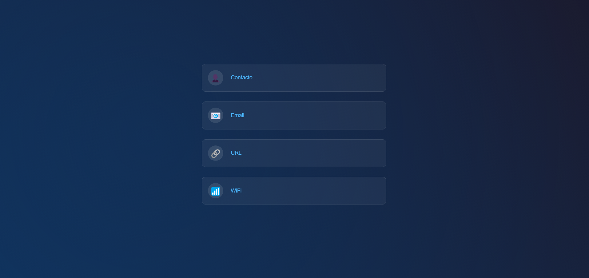
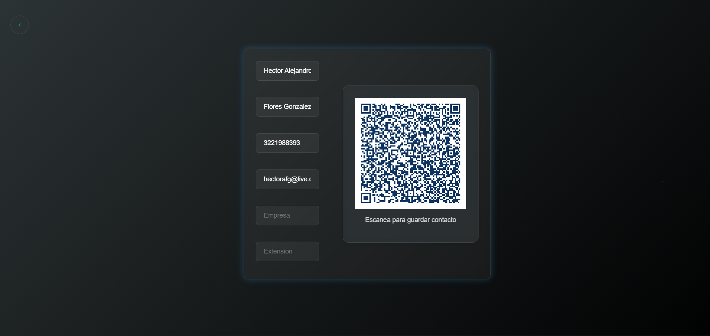

# ReactJS QRCode Generator

Aplicación ReactJS para generar códigos QR personalizados con diferentes formatos y funcionalidades.

## Características principales

- Generación de 4 tipos de QR:
  - **Contacto** (vCard con múltiples campos)
  - **Email** (dirección completa)
  - **URL** (enlaces web)
  - **WiFi** (credenciales de red)
- Interfaz moderna con tema oscuro 🌓
- Animaciones fluidas y efectos visuales
- Diseño 100% responsive 📱💻
- Previsualización en tiempo real del QR
- Botón de descarga integrado (próximamente)
- Validación de campos automática
- Sistema de temas con Context API

## Instalación

```bash
git clone https://github.com/hectorflores28/reactjs-qrcode-generator.git
cd reactjs-qrcode-generator
npm install
npm start
```

## Uso

1. Selecciona el tipo de QR desde el menú principal
2. Completa el formulario correspondiente
3. Visualiza el QR generado en tiempo real
4. Personaliza los colores (próximamente)
5. Descarga el QR en formato PNG/SVG

## Tecnologías utilizadas

- ReactJS
- React Router v6
- qrcode.react
- CSS Modules
- Context API
- Animaciones CSS

## Estructura del proyecto

```
src/
├── components/      # Componentes reutilizables
├── context/         # Gestión de temas
├── styles/          # Estilos globales
└── App.jsx          # Núcleo de la aplicación
```

## Capturas de pantalla

| Menú Principal                   | Formulario Contacto                     |
| -------------------------------- | --------------------------------------- |
|  |  |

## Roadmap 🗺️

- [ ] Descarga directa de QR
- [ ] Historial de generaciones
- [ ] Personalización avanzada de colores
- [ ] Soporte para más tipos de QR
- [ ] Sistema de plantillas

## Contribución 🤝

¡Las contribuciones son bienvenidas! Sigue estos pasos:

1. Haz fork del proyecto
2. Crea tu branch (`git checkout -b feature/nueva-funcionalidad`)
3. Commit tus cambios (`git commit -m 'Add some feature'`)
4. Push al branch (`git push origin feature/nueva-funcionalidad`)
5. Abre un Pull Request

## Licencia 📄

Este proyecto está bajo la licencia MIT
